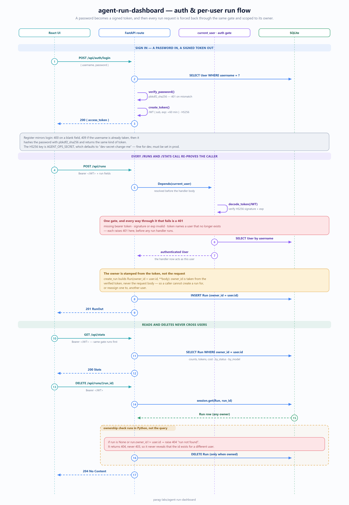

# agent-run-dashboard: design, trade-offs, and non-goals

Status: accepted
Author: Parag Sawant

Why agent-run-dashboard is built the way it is. It's the one full-stack app in the set - a
FastAPI backend with token auth and a React front end - so the design notes are as
much about the shape of a small, honest web app as about any one clever algorithm.

## Problem and goals

Across the little AI tools I build, the same question keeps coming up: what did all
these agent runs cost, and which failed? The data was scattered across logs and
one-off scripts with nowhere to just log in and look. agent-run-dashboard is the smallest honest
version of that dashboard. Goals:

1. Sign in, record a run (a name, model, status, tokens, cost), and see live totals
   and a failure count.
2. Strict **per-user isolation** - you only ever see and touch your own runs.
3. A clean **backend / frontend split** with a typed API between them, so it reads as
   a real app: auth, a database, and a UI wired together, not a toy.

*(Source: [`docs/diagrams/auth-run-sequence.excalidraw`](docs/diagrams/auth-run-sequence.excalidraw) - editable in [excalidraw](https://aka.ms/excalidraw).)*

## Key design decisions

**Token auth, and every data route is user-scoped.** Register or log in, get a signed
JWT, and every `/api/runs` and `/api/stats` query filters on the calling user's id.
Isolation isn't a UI convenience layered on top - it's enforced in the query, so there
is no endpoint that returns another user's data. The load test asserts this holds even
when two users' requests are interleaved rapidly.

**A typed fetch client, separate from the components.** The frontend's request and
error handling lives in one small `api.ts`, not scattered through components. That's
the same "keep the logic testable" instinct the rest of parag-labs uses: the client is
unit-tested against a mocked fetch, and the components just render state.

**Password hashing is pbkdf2_sha256, not bcrypt.** A deliberate portability choice -
pbkdf2 is pure-Python and needs no native build, so the app and its tests run cleanly
on any CI runner without a compiler in the loop. bcrypt/argon2 are stronger and are the
right call for a real deployment; this is called out rather than presented as
production-grade.

## Trade-offs I made on purpose

- **SQLite and a dev secret by default.** Zero-setup: clone and run. That's perfect for
  a single instance and a demo, and wrong for anything real - so `DATABASE_URL` points
  at Postgres and `AGENT_OPS_SECRET` sets the signing key when you deploy it. No refresh
  tokens or password-reset flow yet; those are honest omissions, not oversights.
- **The test DB is one shared in-memory SQLite connection.** This keeps the suite fast
  and hermetic, but SQLite won't let multiple threads share that single connection, so
  the "under load" test exercises a rapid *interleaved* burst through the client rather
  than true thread parallelism. Real cross-worker concurrency is a Postgres + WSGI/ASGI
  server property, not something the in-memory test fixture can or should simulate.
- **Runs are entered through the API/UI.** There's no ingestion adapter yet. Wiring it
  to an emitter (or to agent-trace traces) is the natural next step and is left as one.

## What the "load" test really proves

It's a correctness-under-load check, not a throughput benchmark. Firing a few hundred
rapid, interleaved requests, it pins down the invariants that must never slip on a
multi-tenant service: totals stay exact, users never see each other's data, and auth
gates every request no matter how fast they arrive. Those are the properties worth
guaranteeing; raw requests-per-second on SQLite would measure the test harness, not the
design.

## Non-goals

- **Not a metrics backend.** It stores and shows runs you record; it doesn't scrape,
  aggregate fleet-wide time series, or alert.
- **Not hardened auth.** Token login is real, but production-grade session management
  (refresh tokens, rotation, reset flows, stronger hashing) is out of scope here.
- **Not an ingestion pipeline.** Bringing runs in automatically from a live agent is a
  future adapter, not part of this core.

Part of [parag-labs](https://github.com/parag-labs) - small, focused tools for building AI systems you can trust.
