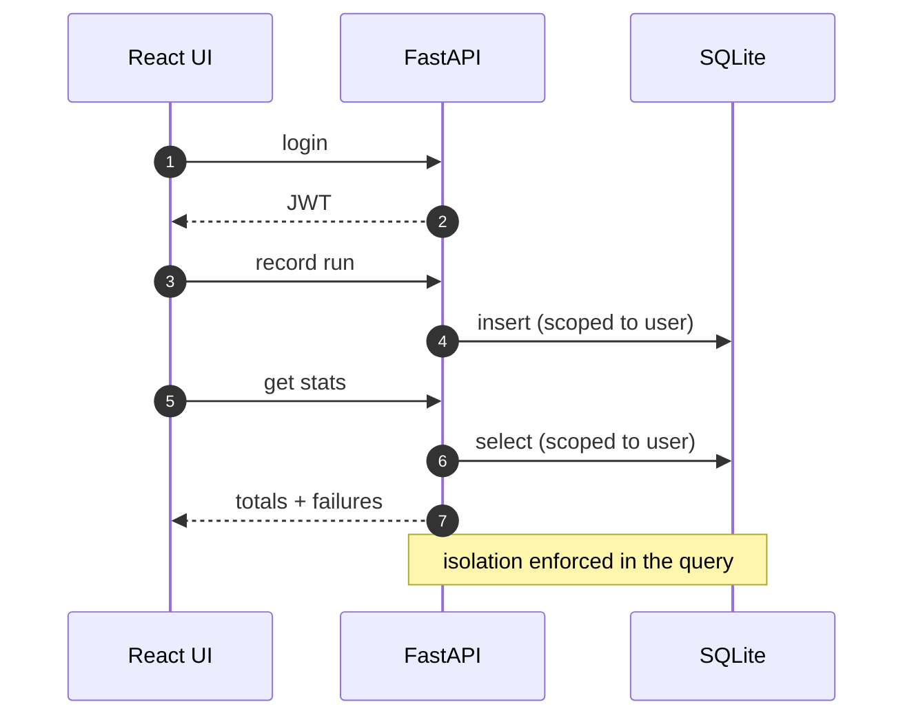

# agent-run-dashboard

A small full-stack dashboard for recording agent runs and watching their cost,
token usage, and failures over time. A FastAPI + SQLite backend with token auth,
and a React front end that logs in and talks to it.

## Why

Across the little AI tools I build, the same question keeps coming up: what did all
these agent runs actually cost, and which ones failed? I had the numbers scattered
across logs and one-off scripts but nowhere to just log in and look. So I built the
smallest honest version of that: sign in, record a run, and see the totals and the
failure count update. It's intentionally generic - a run is just a name, a model, a
status, some tokens, and a cost - so it fits whatever you're running.

It also rounds out the rest of [parag-labs](https://github.com/parag-labs), which
is mostly libraries: this one is an actual app, with a real backend, a database,
authentication, and a UI wired together.

## What's inside

**Backend** (`backend/`, FastAPI + SQLModel + SQLite):

- Token auth - register and log in, get a signed JWT, and every data route is scoped
  to the calling user so you only ever see your own runs.
- Run CRUD - create, list (newest first), and delete runs.
- Aggregate stats - totals for runs, tokens, and cost, plus breakdowns by status and
  by model, computed per user.

**Frontend** (`frontend/`, React + Vite + TypeScript):

- A login / register screen, a stat bar, a form to record a run, and a table with
  status pills and delete buttons.
- A tiny typed `fetch` client kept separate from the components so its request and
  error handling can be unit-tested on their own.

## Running it

Backend:

```
cd backend
pip install -r requirements.txt
uvicorn app.main:app --reload      # http://localhost:8000  (/health, /api/...)
pytest -q
```

Frontend (in another terminal):

```
cd frontend
npm ci
npm run dev                        # http://localhost:5173, proxies /api to :8000
npm test
```

## Tests

| Part | What it covers | Tests |
|------|----------------|:-----:|
| backend | auth flow, token protection, per-user isolation, stats math, load/burst correctness | 17 |
| frontend | api client (mocked fetch), stat bar, run table, run form | 11 |

CI runs the backend tests and the frontend lint + typecheck + tests + build on
every pull request.

## Design notes

- **[DESIGN.md](DESIGN.md)** - the backend/frontend split, why every route is
  user-scoped, the deliberate SQLite/dev-secret/pbkdf2 choices, what the "load" test
  actually proves (correctness under a burst, not throughput), and the non-goals.

## Known limitations

- **SQLite and a dev secret by default.** Fine for a single instance; point
  `DATABASE_URL` at Postgres and set `AGENT_OPS_SECRET` before running it anywhere
  real. There are no refresh tokens or password-reset flows yet.
- **No ingestion adapters.** Runs are entered through the API/UI; wiring it to an
  emitter (or to [agent-trace](https://github.com/parag-labs/agent-trace) traces)
  would be the natural next step.

## How it works



## Layout

```
agent-run-dashboard/
├── backend/        FastAPI + SQLite: token auth, run storage, cost/failure stats (pytest)
│   ├── app/        the API, models, and auth
│   └── tests/      auth, per-user isolation, and stats tests
├── frontend/       React app: login, the stats header, and the run table (Vite)
│   ├── src/        components + API client
│   └── tests/      frontend tests
├── docs/diagrams/  the architecture diagram
└── DESIGN.md       the data model, the auth choice, and the non-goals
```


Part of [parag-labs](https://github.com/parag-labs) - small, focused tools for building AI systems you can trust.
